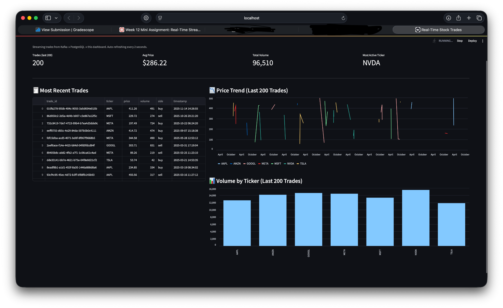

# 📈 Real-Time Stock Trades Streaming Pipeline

Streaming stock trades from **Kafka → PostgreSQL → Streamlit** in real time.

> Week 12 Mini Assignment – Real-Time Streaming System (customized to stock trades domain)

---

## 🧭 Menu

- [Project Overview](#project-overview)
- [Data Domain & Event Schema](#data-domain--event-schema)
- [Architecture](#architecture)
- [Components](#components)
  - [Kafka Producer](#kafka-producer)
  - [Kafka Topic](#kafka-topic)
  - [Kafka Consumer & PostgreSQL](#kafka-consumer--postgresql)
  - [Streamlit Dashboard](#streamlit-dashboard)
- [Getting Started](#getting-started)
  - [Prerequisites](#prerequisites)
  - [Setup](#setup)
- [How to Run the Pipeline](#how-to-run-the-pipeline)
- [Dashboard Walkthrough](#dashboard-walkthrough)
- [Possible Extensions](#possible-extensions)
- [Notes & Troubleshooting](#notes--troubleshooting)

---

## Project Overview

This project implements a **real-time data streaming system** using:

- **Apache Kafka** as the message broker
- **Python producers/consumers** with `confluent-kafka`
- **PostgreSQL** as the storage layer
- **Streamlit** as a live, auto-refreshing dashboard

This file streams **synthetic stock trades**, and a “mini Bloomberg terminal”

---

## Data Domain & Event Schema

### Domain: 💸 Stock Trades

Each event in the stream represents a **single stock trade** executed on a (fake) exchange.

**Event schema (`trade`):**

```json
{
  "trade_id": "UUID string",
  "ticker": "AAPL | MSFT | GOOGL | AMZN | TSLA | META | NVDA",
  "price": 123.45,
  "volume": 500,
  "side": "buy | sell",
  "timestamp": "ISO-8601 timestamp"
}
```

These events are:

1. **Generated** by the producer in real time
2. **Pushed** to a Kafka topic
3. **Consumed** and **written** into the `trades` table in PostgreSQL
4. **Queried** and visualized by Streamlit every 2 seconds

---

## Architecture

High-level architecture of the system:

```text
          ┌────────────────┐
          │  Trade Producer│
          │ (Python + Faker│
          │  + confluent-  │
          │      kafka)    │
          └───────┬────────┘
                  │
                  │  JSON stock trades
                  ▼
           ┌──────────────┐
           │   Kafka      │
           │  Topic:      │
           │   "orders"   │
           └──────┬───────┘
                  │
                  │  consume messages
                  ▼
        ┌──────────────────────┐
        │ Kafka Consumer       │
        │ (Python +            │
        │  confluent-kafka)    │
        │  → writes into       │
        │  PostgreSQL          │
        └─────────┬────────────┘
                  │
                  │  INSERTs
                  ▼
        ┌──────────────────────┐
        │  PostgreSQL          │
        │  DB: kafka_db        │
        │  Table: trades       │
        └─────────┬────────────┘
                  │
                  │  SELECT latest trades
                  ▼
        ┌──────────────────────┐
        │  Streamlit Dashboard │
        │  (auto-refreshing    │
        │   every 2 seconds)   │
        └──────────────────────┘
```

---

## Components

### Kafka Producer

File: `producer.py`

- Uses **`confluent-kafka`** (not `kafka-python`, which is broken on Python 3.12).
- Uses `Faker` + `random` to generate synthetic stock trades with fields:
  - `trade_id`, `ticker`, `price`, `volume`, `side`, `timestamp`
- Sends one trade per second to the Kafka topic `"orders"`.
- Prints each produced trade and basic delivery info.

### Kafka Topic

- Single topic: **`orders`**
- Created via Docker/Kafka CLI (once per environment):

  ```bash
  docker exec -it kafka kafka-topics --create     --topic orders     --bootstrap-server localhost:9092     --partitions 1     --replication-factor 1
  ```

- You can list topics with:

  ```bash
  docker exec -it kafka kafka-topics --list --bootstrap-server localhost:9092
  ```

### Kafka Consumer & PostgreSQL

File: `consumer.py`

- Uses **`confluent-kafka`** to consume messages from topic `"orders"`.
- Uses **`psycopg2`** to connect to PostgreSQL.
- Inserts each trade into the `trades` table:

  ```sql
  CREATE TABLE trades (
      trade_id   VARCHAR PRIMARY KEY,
      ticker     VARCHAR(10),
      price      NUMERIC(10, 2),
      volume     INTEGER,
      side       VARCHAR(10),
      timestamp  TIMESTAMP
  );
  ```

- Consumer config:
  - `group.id = "trades-consumer-group-v2"`
  - `auto.offset.reset = "latest"` so it only reads **new** trades.


### Streamlit Dashboard

File: `dashboard.py`

- Connects to PostgreSQL and queries the latest ~200 trades.
- Auto-refreshes every **2 seconds**.
- Shows:
  - KPI metrics:
    - Trades (last 200)
    - Average price
    - Total volume
    - Most active ticker (by volume)
  - Table of the most recent trades
  - Line chart of **price trend** over time, per ticker
  - Bar chart of **volume by ticker**



```

---

## Getting Started

### Prerequisites

- **Python 3.12+**
- **Docker & Docker Compose**
- `pip` for installing Python dependencies

### Setup

1. **Clone the repository**

   ```bash
   git clone <your-repo-url>.git
   cd kafka_realtime_pipeline
   ```

2. **Install Python dependencies**

   ```bash
   pip install -r requirements.txt
   ```

   Or manually (if needed):

   ```bash
   pip install confluent-kafka faker psycopg2-binary pandas plotly streamlit sqlalchemy
   ```

3. **Start Kafka + PostgreSQL via Docker**

   ```bash
   docker compose up -d
   ```

   This starts:
   - Kafka broker (`kafka`)
   - PostgreSQL (`postgres`)

4. **(First-time only) Ensure the `orders` topic exists**

   ```bash
   docker exec -it kafka kafka-topics --create      --topic orders      --bootstrap-server localhost:9092      --partitions 1      --replication-factor 1
   ```

   If the topic already exists, Kafka will simply warn you and you can ignore it.

5. **(First-time only) Create the `trades` table**

   ```bash
   docker exec -it postgres psql -U kafka_user -d kafka_db

   -- inside psql:
   CREATE TABLE trades (
       trade_id   VARCHAR PRIMARY KEY,
       ticker     VARCHAR(10),
       price      NUMERIC(10, 2),
       volume     INTEGER,
       side       VARCHAR(10),
       timestamp  TIMESTAMP
   );
   ```

   Then exit with `\q`.

---

## How to Run the Pipeline

### 1. Start Docker services

Make sure Kafka & Postgres are running:

```bash
docker compose up -d
docker ps   # to verify
```

### 2. Start the Kafka consumer (Python → Postgres)

In one terminal:

```bash
cd kafka_realtime_pipeline
python consumer.py
```

You should see:

```text
🟢 Consumer started. Waiting for trades...
📥 Received raw message: {...}
```

As trades arrive, they will be inserted into the `trades` table.

### 3. Start the Kafka producer (stock trades → Kafka)

In a **second** terminal:

```bash
cd kafka_realtime_pipeline
python producer.py
```

```

### 4. Start the Streamlit dashboard

In a **third** terminal:

```bash
cd kafka_realtime_pipeline
streamlit run dashboard.py
```

Open the URL and you’ll see the live dashboard.

---

## Dashboard Walkthrough

The dashboard auto-refreshes every **2 seconds** and shows:

### KPI Row

- **Trades (last 200)** – how many recent trades are visualized
- **Avg Price** – average price of those trades
- **Total Volume** – sum of traded shares
- **Most Active Ticker** – ticker with the highest volume in the recent window

### Most Recent Trades Table

A table of the latest trades pulled from PostgreSQL, including:

- `trade_id`
- `ticker`
- `price`
- `volume`
- `side`
- `timestamp`

### Price Trend (Last 200 Trades)

- Line chart of price over time.
- Plotted per ticker, using the last 200 trades.
- Lets you visually check how volatile the synthetic market is.

### Volume by Ticker (Last 200 Trades)

- Bar chart of total volume per ticker in the recent window.
- Quickly highlights which ticker is currently “most active”.

---

## Summary

This project customizes the original real-time streaming demo into a **stock trades** domain, demonstrating:

- Synthetic event generation
- Kafka-based streaming
- Real-time ingestion into PostgreSQL
- A live updating Streamlit dashboard


